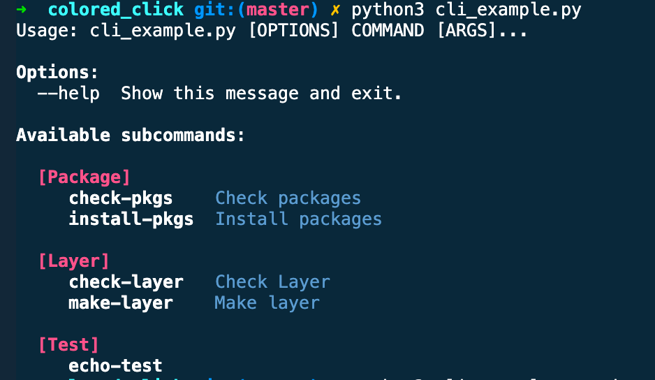
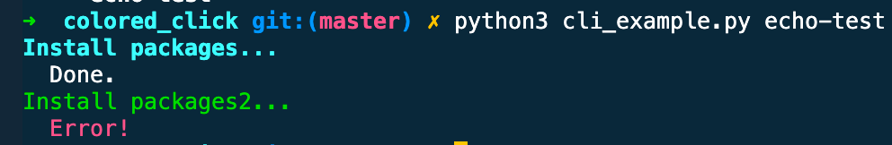

# Colored Click


## Usage

### colored_subcommand_group
```python
from colored_click import colored_subcommand_group

subcommand_sections = [
    {"name": "Package", "ends_with": "pkgs"},
    {"name": "Layer", "ends_with": "layer"},
]

@colored_subcommand_group(subcommand_sections=subcommand_sections)
def cli():
    pass

@cli.command()
def check_pkgs():
    colored_echo("Check packages...")
    colored_echo("  Done.")
...
```
* **results**
  
    

### colored_echo
```python
from colored_click import colored_echo

...
@cli.command()
def echo_test():
    colored_echo("Install packages...")
    colored_echo("  Done.")
    colored_echo("Install packages2...", color="green")
    colored_echo("  Error!", color="red")
...
```
* **results**
  
  